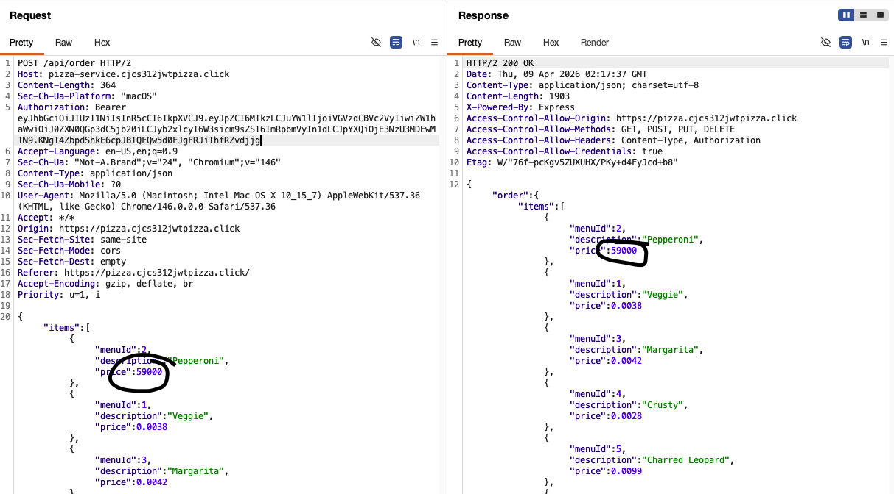
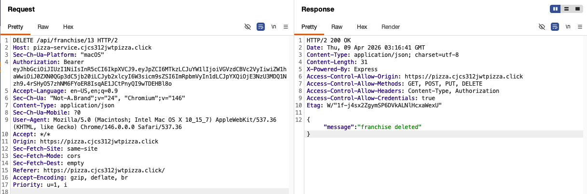
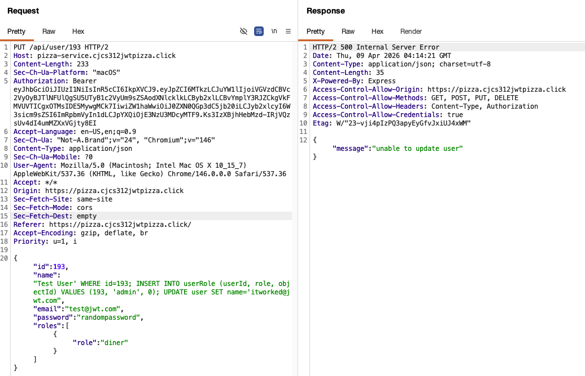
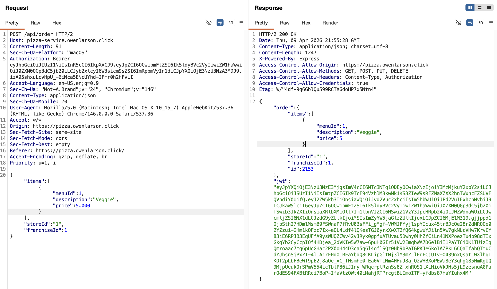
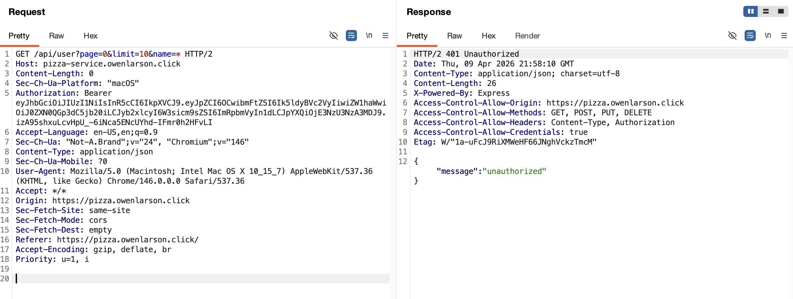
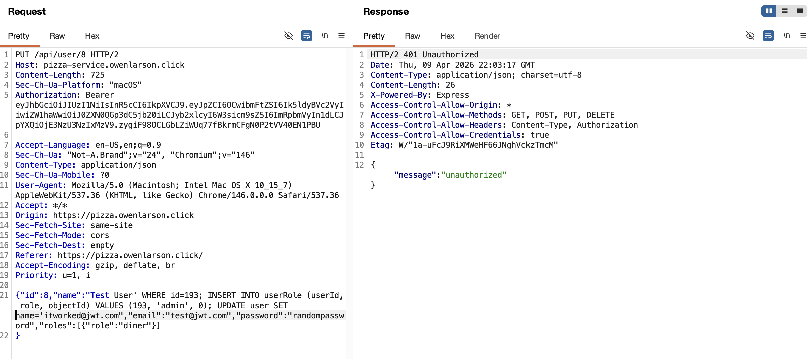
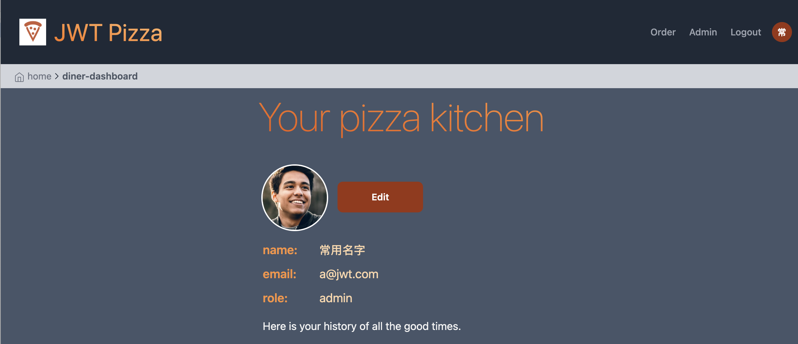
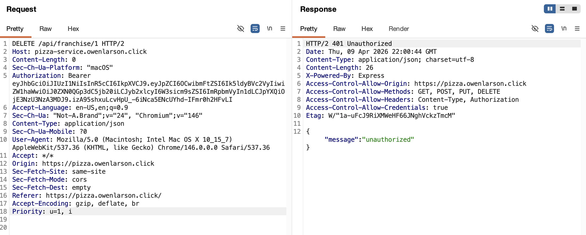

# Peer Penetration Test Results

## Cooper Self Attack

| Test 1         | Result                                                                        |
|----------------|-------------------------------------------------------------------------------|
| Date           | April 8, 2026                                                                 |
| Target         | pizza.cjcs312jwtpizza.click                                                   |
| Classification | Insecure design                                                               |
| Severity       | 1                                                                             |
| Description    | Changed order item prices in request and application used the changed prices. |
| Images         |                                |
| Corrections    | Verify menu items and prices in the backend                                   |

| Test 2         | Result                                                                        |
|----------------|-------------------------------------------------------------------------------|
| Date           | April 8, 2026                                                                 |
| Target         | pizza.cjcs312jwtpizza.click                                                   |
| Classification | Security Misconfiguration                                                     |
| Severity       | 1                                                                             |
| Description    | Changed order item prices in request and application used the changed prices. |
| Images         |       |
| Corrections    | Add admin role check before deleting franchises                               |

| Test 3         | Result                                                |
|----------------|-------------------------------------------------------|
| Date           | April 8, 2026                                         |
| Target         | pizza.cjcs312jwtpizza.click                           |
| Classification | Injection                                             |
| Severity       | 0                                                     |
| Description    | Failed to inject multiline sql into database          |
| Images         |    |
| Corrections    | N/A                                                   |

## Attack on Owen

| Test 1         | Result                                                                        |
|----------------|-------------------------------------------------------------------------------|
| Date           | April 9, 2026                                                                 |
| Target         | pizza.owenlarson.click                                                        |
| Classification | Insecure design                                                               |
| Severity       | 1                                                                             |
| Description    | Changed order item prices in request and application used the changed prices. |
| Images         |                           |
| Corrections    | Verify menu items and prices in the backend                                   |

| Test 2         | Result                                                  |
|----------------|---------------------------------------------------------|
| Date           | April 9, 2026                                           |
| Target         | pizza.owenlarson.click                                  |
| Classification | Security Misconfiguration                               |
| Severity       | 1                                                       |
| Description    | Failed to get user list as an unauthorized user         |
| Images         |    |
| Corrections    | Add admin role check before deleting franchises         |

| Test 3         | Result                                                    |
|----------------|-----------------------------------------------------------|
| Date           | April 9, 2026                                             |
| Target         | pizza.owenlarson.click                                    |
| Classification | Injection                                                 |
| Severity       | 0                                                         |
| Description    | Failed to inject franchise into database                  |
| Images         |    |
| Corrections    | N/A                                                       |

| Test 4         | Result                                          |
|----------------|-------------------------------------------------|
| Date           | April 9, 2026                                   |
| Target         | pizza.owenlarson.click                          |
| Classification | Insecure design                                 |
| Severity       | 3                                               |
| Description    | Logged in as default admin user                 |
| Images         |      |
| Corrections    | Remove/change admin default users and passwords |

| Test 5         | Result                                                               |
|----------------|----------------------------------------------------------------------|
| Date           | April 9, 2026                                                        |
| Target         | pizza.owenlarson.click                                               |
| Classification | Security Misconfiguration                                            |
| Severity       | 0                                                                    |
| Description    | Failed to delete franchise as unauthorized user.                     |
| Images         |    |
| Corrections    | N/A                                                                  |
